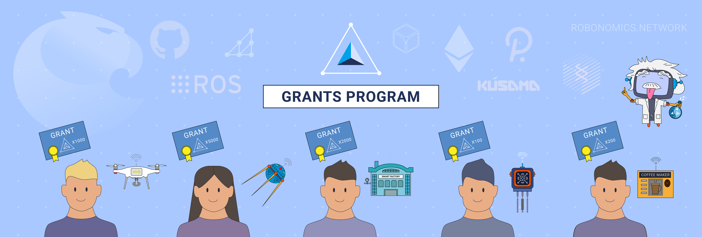

# Robonomics Grant Program <!-- omit in toc -->

  

---

In 2021, the Robonomics Network launches its first Grant Program to support academic research in the field of networked cyber-physical systems. While promoting the core values of the Robonomics Network (read them [here](https://gateway.pinata.cloud/ipfs/QmNNdLG3vuTsJtZtNByWaDTKRYPcBZSZcsJ1FY6rTYCixQ/Robonomics_keypoint_March_2021.pdf)), the Grant Program is aimed at helping researchers and developers to implement cutting-edge projects with robotic and IoT devices operating and communicating in a distributed network environment. 

The second round of grant proposals is open from September 2021 till March 2022.

## :robot: Introduction

We know well how difficult it can be to complete a proof-of-concept or an experiment within a short timeframe in the academic environment. Researchers often have to apply for support through administratively heavy and slow funding programs. Many research funding agencies avoid supporting risky ‘rebellious’ projects. For these reasons, the Robonomics Grant Program has been built as a simple and quick unbureaucratic tool for helping its beneficiaries to focus on their experiments and other academic projects rather than on paperwork. We achieve transparency during proposal submission and funding processes by using the capabilities of GitHub and [Aragon DAO](https://aragon.org/).

The Robonomics Grant Program invites project proposals on topics including but not limited to:

* Networked cyber-physical systems
* Multi-agent systems
* Robot-as-a-Service
* Industry 4.0 and smart factory
* Smart cities and infrastructure
* Internet-of-Things and IoT networks
* Sensor network
* Peer-to-peer in robotics

## :rainbow: For inspiration

To help you better understand what kind of projects we would like to support, we have prepared a short list of examples:

* **Certified measurements of the quality of water resources using unmanned surface vehicles**

    The main focus here is on an environmental monitoring system built on a fleet of [small marine vessels](https://youtu.be/Mtqm5y6Bolo) equipped with compact sensors. The Robnonomics platform is being used for secure registration of vessels, their missions, and data collection, thereby ensuring the certification of water pollution measurements.

* **Control of industrial site through sales feedback**

    In this project, the concept of a smart factory is being explored: autonomous production occurs by collecting, exchanging and using information between people, materials and machines using network technologies. For this purpose, we have created a [test bench](https://youtu.be/yuxOF_z70us), based on the Fischertechnik сonstruction set and Siemens controllers, which simulates the work of a smart factory, from the supply of raw materials to the shipment of products from warehouses, depending on the demand for it.

* **The robot artist as an autonomous creative system**

    This project aims to expand on the idea of creative robotic devices. The most intriguing thing here is the creation of a completely autonomous creative system capable of developing an idea for an artwork, implementing it, presenting it for review, drawing conclusions on how to proceed further from collected feedback, and even using funds from sales for necessary consumables. We have armed the KUKA KR6 R900 manipulator with a brush and the ability to paint on canvas. The robot called [Gaka-Chu](https://blog.aira.life/gaka-chu-d2f6cfa61390) works on the basis of the Robonomics platform, which allows it, for example, to put paintings up for a [digital auction](https://rarible.com/gakachu).

* **Blockchain as a quality guarantor in the chemical industry**

    In order to develop a [quality control system](https://github.com/Vourhey/chemistry-quality-control) for the production of a certain chemical product, Blockchain was used to make consumers trust the manufacturing company, which cannot forge the results of the audit.

## :mag: Terms of participation

* The maximum funding amount: **50 000 USD** in cryptocurrency.
* The main cryptocurrency for funding is **Robonomics** token ([XRT](https://www.coingecko.com/en/coins/robonomics-network)) at the price at the time of approval of the proposal. Also, in rare cases, we can provide a grant in **Dai Stablecoin** ([DAI](https://www.coingecko.com/en/coins/dai)) or **Ethereum** tokens ([ETH](https://www.coingecko.com/en/coins/ethereum)), but applicants need to provide a reasoned explanation to different cryptocurrency. In the future, we also plan to provide funds in [Kusama](https://kusama.network/) tokens.
* The standart allocation of funds is provided using a **vesting mechanism**, executed as an Ethereum contract using the Aragon platform. The mechanism allows to release the grant reserved tokens in parts for a certain period of time with a certain delay in the first payment, depending on the conditions met and with the possibility of cancellation otherwise.
* Applicants should be aware of the fact that funds are provided in cryptocurrency. Applicants are solely responsible for finding ways to exchange, the costs of transferring funds from cryptocurrency as well as tax issues. 
* We expect all applicants to use the Robonomics platform in their projects, so please check the compatibility with your technology before you apply. Also, please, note that we are using the **Robot Operating System** as a connector for robotic devices and **HTTP / MQTT** protocol for connecting IoT devices. For more information, see [our wiki](https://wiki.robonomics.network/).
* Moreover, we expect projects to be actively involved in the Robonomics infrastructure. You need to decide on a period (**from 3 to 12 months**) during which your project will **regularly send transactions** with any data to Robonomics Network. We request this information to understand the potential network load. 
* By the end of the project, you must provide a set of deliverables, such as reports, articles, repositories, modules, launch guides, etc.
* We give priority to teams with research background, so projects of **MSc or PhD students**, **young scientists and researchers** are more welcome. However, if your project idea is innovative and requires proof of concept, we will gladly consider your proposal.
* The proposals will be reviewed by the Robonomics developers, who then will cast their votes on **Aragon DAO** platform. Approved applications will be funded immediately.
* Since our project follows the **open source** paradigm, we strongly encourage you to follow it. More than 50% of the grant results must be published in the open access and under open-source licenses.

## :memo: Step-by-step instruction

1. **Preparing a Proposal**
    1. Fork this repository.
    2. Create a copy of the proposal template ([`proposals/proposal-template.md`](proposals/proposal-template.md)) in the newly created fork. If you are using the GitHub web interface, you will need to create a new file and copy the [contents](https://raw.githubusercontent.com/airalab/robonomics-grant-program/main/proposals/proposal-template.md) of the template inside the new one. **Warning:** *do not modify the template file directly*.
    3. Name the new file after your project: `project_name_here.md`.
    4. Complete the template with details about your project. We recommend to provide full and comprehensive information to speed up the proposal review process.
    5. After that, create a pull request. **Warning:** the pull request should only contain *one new file* — the Markdown file you created from the template.
2. **Proposal Review and Funds Allocation**
    1. After the proposal is received, it is very likely that we will make comments and ask you to make changes on the pull request.
    2. Clarifications and corrections made in the comments *need to be included in the proposal*. You may modify your proposal directly and leave a comment about the edits you made.
    3. The final approval process for the proposal is based on voting by Robonomics developers on the [Aragon platform](https://client.aragon.org/#/aira/0xac0e9db1acd16052fac41d9f7e818a945be41c4b/). The conditions for passing are very loyal to the recipients: if at least one of the Robonomics developers supports your project, then the proposal will be approved. This proccess lasts 3 days from the moment the request for voting was created.
    4. The proposal is accepted when all requested changes are addressed and we approved your pull request.
    5. The default delay for funds allocation is 30 days. After the delay expires, the reserved funds will begin to be released in parts every day, in equal shares, depending on the whole amount and the duration of grant. You can at any time transfer the received XRT/ETH/DAI tokens to Ethereum address specified in the proposal. To do this, visit Robonomics dApp at <https://dapp.robonomics.network/#/vesting-grants> and send a transaction to transfer tokens.
3. **Results Delivery**
    1. During the project development, you should fill out **every two weeks** the Grant Diary, which briefly (up to one A4 page) describes the intermediate results obtained. You can find the Grant Diary process [here](https://github.com/airalab/robonomics-grant-results).
    2. After the end of the project, the list of results with links is placed in the Robonomics Grant Results repository. You can find the delivery process [here](https://github.com/airalab/robonomics-grant-results).

## :link: Links

### :newspaper: General information and news

Subscribe to our media to keep abreast of events and news from the Robonomics ecosystem.

| [Website](https://robonomics.network/) | [Main GitHub](https://github.com/airalab) | [Robonomics Wiki](https://wiki.robonomics.network/) | [Twitter](https://twitter.com/AIRA_Robonomics) | [Medium blog](https://blog.aira.life/) | [Reddit](https://www.reddit.com/r/robonomics/) | [YouTube channel](https://www.youtube.com/channel/UCrSiho1uB-1n6F8cZpCLhjQ) |

### :speech_balloon: Live communication channels

You can always participate in a discussion or ask a technical question. Join the community!

| [Telegram chat](https://t.me/robonomics) | [Element (Riot)](https://riot.im/app/#/room/#robonomics:matrix.org) | [Main forum](https://discourse.robonomics.network/) |

## :information_source: License & Acknowledgment <!-- omit in toc -->

[Apache License 2.0](LICENSE) © Airalab.

Robonomics Grant Program is inspired by [Web3 Foundation Open Grants Program](https://github.com/w3f/Open-Grants-Program).
