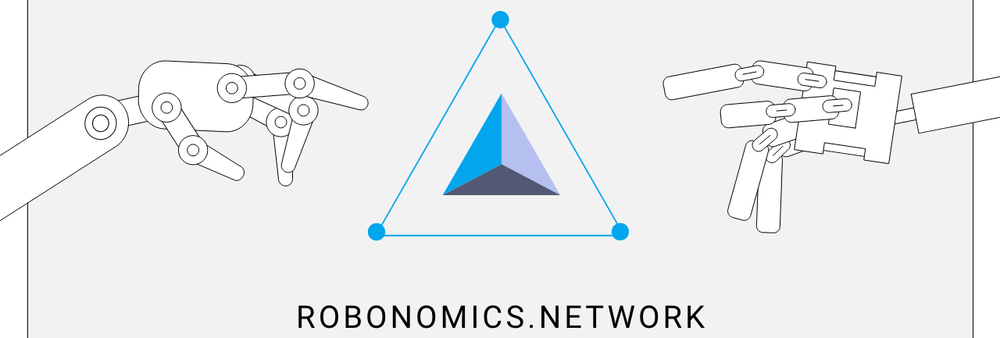

# Robonomics Grants Program <!-- omit in toc -->

  

---

## Introduction

The grant support from Robonomics Network is the first open grant program for projects in the field of networked cyberphysical systems. In addition to promoting the core values of Robonomics, our goal is to help researchers and developers in their cutting-edge challenges for robotic and IoT devices that operate and communicate over the distributed network enviroment.

From our experiance of academic practice, we understand well how important it is sometimes to quickly complete a proof-of-concept or experiment, but in a robotic sphere, expensive equipment and the need to configure it are a bottleneck. Gaining university support for a potentially breakthrough or rebellious technical project can take a long time due to administrative barriers, which easily negates all research enthusiasm. For these reasons, the program exists on the condition that it be as simple and quick as possible, with a minimum of bureaucracy, so that recipients can devote more time to their projects. Also, we want to keep our relationship with recipients transparent during proposal submission and funding, so we use the capabilities of GitHub and [Aragon DAO](https://aragon.org/).

### Terms of participation

* The maximum funding amount: **50 000 DAI**.
* Funding is provided in **Robonomics tokens** ([XRT](https://www.coingecko.com/en/coins/robonomics-network)) at the price at the time of approval of the proposal.
* You should use the Robonomics platform in your project, so first make sure that it is compatible with our platform. Please note that we are using the **Robot Operating System** as a connector for robotic devices and **HTTP / MQTT** protocol for connecting IoT devices. For more information, see [our wiki](https://wiki.robonomics.network/).
* By the end of the project, you must provide some set of deliverables, such as reports, articles, repositories, modules, launch guides, etc.
* There are no strong restrictions on participation in the program, but we give priority to teams that have some research background (for example, if you are **PhD student**) or development experience in robotics. In any case, your chances of grant approval are increased based on your proven experience, which we ask you to describe in the proposal.
* The proposal approval comes from voting process by the Robonomics developers on **Aragon DAO** platform.
* Since our project follows the **open source** paradigm, we strongly encourage you to follow it. At least some part of the code should be in open repositories, and part of materials, articles and reports should be open access.

## Step-by-step instruction

1. **Preparing a Proposal**
    1. Fork this repository.
    2. Create a copy of the proposal template ([`proposals/proposal-template.md`](proposals/proposal-template.md)) in the newly created fork. If you are using the GitHub web interface, you will need to create a new file and copy the [contents](contents) of the template inside the new one. **Warning:** *do not modify the template file directly*.
    3. Name the new file after your project: `project_name_here.md`.
    4. Complete the template with details about your project. We recommend to provide full and comprehensive information to speed up the proposal review process.
    5. After that, create a pull request. **Warning:** the pull request should only contain *one new file* — the Markdown file you created from the template.
    6. Sign off on the [terms and conditions](T&Cs.md).
2. **Proposal Review**
    1. After the proposal is received, the Robonomics team proceeds to its review. It is very likely that we will make comments and ask you to make changes on the pull request.
    2. Clarifications and corrections made in the comments *need to be included in the proposal*. You may modify your proposal directly and leave a comment about the edits you made.
    3. The final approval process for the proposal is based by voting at the Aragon DAO. The conditions for passing are very loyal to the recipients: if at least one of the Robonomics developers supports your project, then the proposal will be approved.
    4. The proposal is accepted when all requested changes are addressed, the terms and conditions have been agreed upon and we approves your pull request.
3. **Results Delivery**
    1. After the end of the project, the list of results with links is placed in the Robonomics Grant Results Delivery repository. You can find the delivery process [here](link).

## Links

### General information and news

Subscribe to our media to keep abreast of events and news from the Robonomics ecosystem.

| [Website](https://robonomics.network/) | [Main GitHub](https://github.com/airalab) | [Robonomics Wiki](https://wiki.robonomics.network/) | [Twitter](https://twitter.com/AIRA_Robonomics) | [Medium blog](https://blog.aira.life/) | [Reddit](https://www.reddit.com/r/robonomics/) | [YouTube channel](https://www.youtube.com/channel/UCrSiho1uB-1n6F8cZpCLhjQ) |

### Live communication channels

You can always participate in a discussion or ask a technical question. Join the community!

| [Telegram chat](https://t.me/robonomics) | [Element (Riot)](https://riot.im/app/#/room/#robonomics:matrix.org) | [Main forum](https://discourse.robonomics.network/) |

## License & Acknowledgment <!-- omit in toc -->

[Apache License 2.0](LICENSE) © Airalab.

Robonomics Grants Program is inspired on the experience of [Web3 Foundation Open Grants Program](https://github.com/w3f/Open-Grants-Program).
