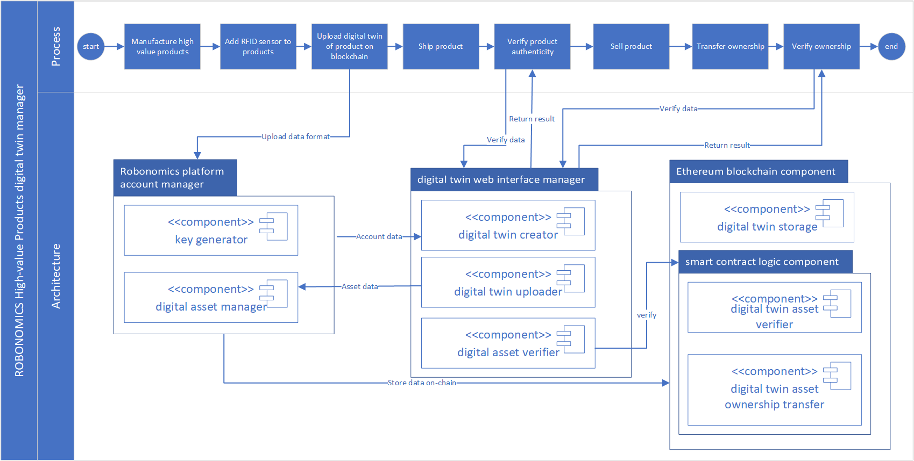
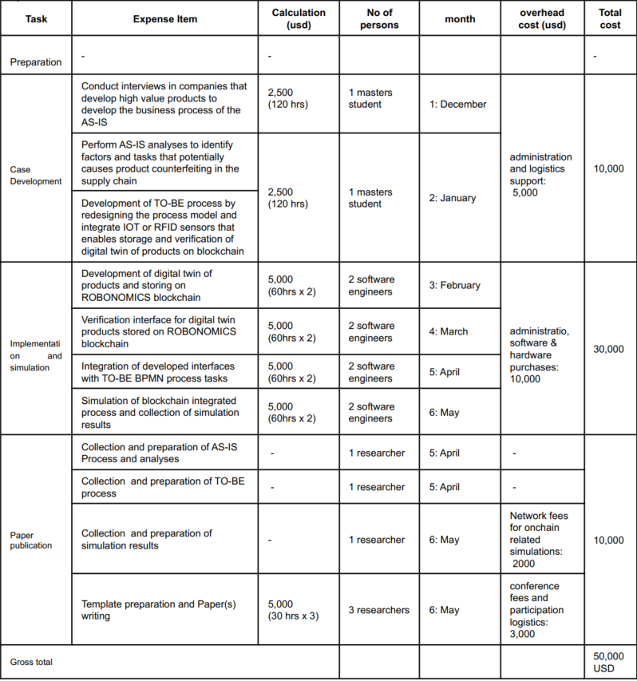

# Robonomics Grant Proposal

## 1. Administrative Information :white_check_mark:

* **Project Name:** LogisticsBDT (Logistics Blockchain Digital Twin)
* **Organisation Name:** Dymaxion OÜ and Logistics department, University of Applied Sciences Upper Austria (FHOOE)
* **Project Summary:** To show how Robonomics Network and IOT related technologies can be applied in a given high-value supply chain to address the problem of fake products identification, verification of authentic products and tracking products ownership using digital twins concepts
* **Total Estimated Duration:** 6 months (plus a month preparatory period)
* **Expected Project Start / End Dates:** 01.11.2021 – 31.05.2022
* **Requested Funding:** DAI 50,000 USD
* **Payment Address:** 0xE358C31500EF2a7e33464C3C513d1f71F92B6BAb

---

## 2. Project Overview :bookmark_tabs:

1. What are the problems that the project is trying to solve?
Product counterfeiting is a serious and increasing problem in supply chains, especially in high-value products. 
It poses economic challenges to manufacturers and poses dangers to the general well-being of customers that use such products. 
Counterfeiting occurs in heavy industries manufacturing, automotive, aviation, pharmaceuticals etc [1]. 
A lot of approaches have been proposed by researchers to address counterfeiting problems and such approaches include trademarking, patenting, improving product quality and the general brand name of legitimate producers [1,2]. 
Still, the problem of counterfeiting continues because customers have no means to independently verify the authenticity of products transparently and efficiently. 

2. Why do you want Robonomics Network to be used for solving those problems? 
To show how Robonomics Network and IOT related technologies can be applied in a given supply chain to address the problem of fake products and verification of authentic products. 
With the opportunities which blockchain technologies, IoT and RFID sensors provide, digital twin a high-value physical product can be coded in a data format and stored on the blockchain. 
Thus, the authenticity and ownership of such products can be tracked on the blockchain. 
The Robonomics platform provides the possibility for developing systems that involve the interaction of IoT sensors and devices with the information stored on the blockchain. 
Therefore, this project seeks to redesign the supply process for high-value products by using the Robonomics platform and related IoT technologies for storing and verifying the authenticity of products using digital twin concepts.

3. What are the expected main result of the project?
- Development and analysis of the current supply chain process of high-value value
- Redesign of the supply chain process of high-value products by integrating IoT (RFID) sensors and for storing digital twin of products on the Robonomics Network platform 
- A simulation of a redesigned supply chain for high-value products that use IoT sensors to record digital twins of a product on the Robonomics platform.
- A simulation of the redesigned supply chain for high-value products showing the verification of authentic products and tracking of products ownership on the Robonomics platform.

4. Do you plan to exploit the result in the future (academic, commercial)?
The main results of the project will be fully exploited for the publications of research paper(s) that show the application of the Robonomics platform in combating the problem of product counterfeiting in high-value supply chains.
There is also possibility of exploiting the developed project for commercialization.

5. What is your personal motivation to implement this project?
The main motivations are as follows: this project shows a real use-case of blockchain addressing problems faced by many business organizations. The project is not necessarily too long with a tangible and measurable output that can be easily assessed.

6. Are there any other projects similar to yours? 
  - The project  [3] explores the application of digital twins for tracing the authenticity of manufactured parts in the aircraft industry.
  - The project  [4] developed a framework for the development of digital twins for personalized products for industry 4.0 

7. In what way is your project different from the existing ones?
These two projects consist of digital twins proposals and methodologies that have not been implemented or evaluated with actual results from a running application. 
In our proposal, we seek to redesign the current logistic process of high-value products, implement the redesigned process on the Robonomics platform, simulate the implemented solution and gather the necessary results. 
Thus, the results will be published in a paper showing the application of Robonomics in stamping out fake products in logistics. 
Also, the listed similar projects are specific to a unique type of supply chain - aircraft manufacturing and personalized products manufacturing. Our case is represented by any industry that manufactures or delivers high-value products in its supply chain. 
Therefore, we will conduct a series of interviews with practitioners in this type of industry to conceptualize the current logistic process of high-value products

## 3. Technical Details :pager:

1. An overview of the technology stack to be used. This may include items such as: 
    1. Links to documentation of software, components, protocols, architecture, data models, API specifications, etc. that you based your project on.
      
      - The Robonomics White paper contain technical descriptions about the platform. This, therefore, serves as the first point of call for information about the platform- https://static.robonomics.network/docs/presentations/Robonomics.Keypoint.updated.August.2020.pdf
      - Digital twins - They are digital (software) copies of a physical Asset.
      - https://azure.microsoft.com/en-us/blog/azure-digital-twins-now-generally-available-create-iot-solutions-that-model-the-real-world/
      - Parachain on the Robonomics Network allow the user to create digital twins - https://robonomics.network/blog/the-ultimate-guide-to-robonomics-rws-and-robonomics-parachain-on-polkadot/
      - Build a Digital Twin for Thousands of IoT Devices with Apache Kafka and MongoDB - https://www.youtube.com/watch?v=ue_9iFoXhNc
      - Robonomics marketplace - https://dapp.robonomics.network/#/services
      - Robonomic communities: we also will potentially get information from the community when needed. Therefore, we consider this as an additional tool for gathering information during the project implementation - https://robonomics.network/community/#science
      - Aira OS: we can use this as an OS for connecting IoT devices to the Robonomics network - https://wiki.robonomics.network/docs/en/aira-installation-on-vb/,  https://wiki.robonomics.network/docs/en/interact-with-aira/
      - Robonomic web service for potentially storing information about digital twin assets - https://robonomics.cloud/
    - Tools
         - Robonomics-js is a simple Javascript library for working with Robonomics Network. - https://wiki.robonomics.network/docs/en/robonomics-js/
         - Solidity, Angular, Python, Nodejs, Web3, Ethereum and Polkadot Ipfs version 0.34.0 - IPFS is a distributed system for storing and accessing files, websites, applications, and data".
         - Web3 version 1.2.4
         - Robonomics Network agent - Usually it's represented as a ROS package and it may connect (but not necessarily) a real cyber-physical system to the Robonomics Network.
         - LIGHTHOUSE - A lighthouse is an autonomous workflow that allows us to distribute the running time of providers that serve a single broadcast channel.
         
         - DIGITAL TWINS - https://wiki.robonomics.network/docs/en/digital-twins/, https://dapp.robonomics.network/#/iot/twins, https://www.youtube.com/watch?v=nRVG4CQY7_4

    2. Robot Operating System packages to be used: potential operating systems that we will use in developing and deploying IoT objects integrated into the logistic supply chain of the high-value products.
       -  https://www.ros.org/, 
       -  http://wiki.ros.org/rospy
       -  ROS integration - https://github.com/airalab/robonomics#7-robotics-integration
       -  Ros installation - http://wiki.ros.org/action/fullsearch/ROS/Installation?action=fullsearch&context=180&value=linkto%3A%22ROS%2FInstallation%22
       -  https://wiki.robonomics.network/docs/en/robonomics-liability/
       -  IOT Simulation environment: 
          - https://www.simplesoft.com/SimpleIoTSimulator.html 
          - Node-red IOT device simulator - https://flows.nodered.org/flow/de9ad7f94c78343416ccb1ec0d4a5b2b
       -  Process/ Workflow Simulation environment: this is an environment for simulating the redesigned logistic supply chain process that is integrated with the Robonomics Network, IoT devices and digital twin assets.
            - JBoss business process management tool: https://www.jbpm.org/
            - YAWL business process management tool https://www.jbpm.org/

    3. Description of the robots, devices, sensors, equipment, etc. to be used.          
       - Iotify, Nesim and MATLAB IoT module are possible IOT virtual environments that we can use to simulate the IOT sensors and readers attached to physical high-value products in logistics supply chains.
       - Other possible sensors that we also considered are high frequency RFID tags and their readers such that the tags can easily be attached to a physical high value products and their movement across supply chain will be simulated with their readers.

    4. Known studies, methods, algorithms that you want to use.
      - Digital twin standards: https://www.sciencedirect.com/science/article/pii/S2212827116313129
    5. Previous projects, Proof-of-Concept, MVP that you based this project on.
     	- This project is not based on any PoC or MVP of a previous project.
          
2. In the case of the prior development, any details about it: publications, repositories, articles, etc.
  - Blockchain-based certificate verification system: Implementation code on Github: https://github.com/Dynamic-Flakes/E-Cert-Dapp
	- Blockchain-based KYC system: Whitepaper: https://scholar.google.com/citations?view_op=view_citation&hl=en&user=0fKaTa8AAAAJ&cstart=20&pagesize=80&citation_for_view=0fKaTa8AAAAJ:zYLM7Y9cAGgC

3. i) How your project uses Robonomics Network: 

High valued products in a  Simulated logistics supply chain will be encoded with RFID/IoT sensors that contain digital twin information about the product. Each manufacturer of such a product will maintain a Robonomics account to read and store the digital twin information of the products on the Robonomics/ Ethereum blockchain. As the encoded product moves along the supply chain logistic, each product can be verified by scanning RFID data and verifying their authenticity on the Robonomics/ Ethereum platform. The ownership of the digital asset (digital twin) can be transferred as the high-value product moves along the supply chain using smart contracts. The current owner of the product can be confirmed instantly by checking the last account associated with the digital twin on the blockchain.
Figure 1 shows a high-level description of the digital twin manager for high valued products. The first layer shows the process part that outlines logistic activities in the supply chain of high-value products. The second layer shows the main components that enable the creation, verification and tracking of the digital twin of high valued products. The three main components include the Robonomics platform account manager, digital twin web interface and ethereum blockchain component.     The Robonomics platform account enables the creation of accounts and management of digital assets linked to the accounts. This component enables the interaction of physical objects (attached with IoT/Rfid sensors) with their digital twin representatives on the blockchain. The ethereum blockchain component enables the storage of digital assets on the blockchain and also provides a smart contract interface for verifying the authenticity of objects and transferring their ownership to a different account as the product moves along the supply chain. The web interface provides the possibility for the participants in the supply chain to track ownership and verify the authenticity of high-value products as they move along the supply chain. The web interface interacts directly with the smart contract component of the blockchain in verifying and tracking high-value products.

Figure 1: Proposed Architecture

 ii) Description of the planned load on the Robonomics network: indicate the period (3-9 months) and briefly describe the intended purpose of the transactions.
 Most of the traffic from this project to the Robonomics network will be basically in the creation of digital twins, reading of digital twin data and verifying the current ownership of digital twin data. These traffics will be generated in the last 4 months of the project during the implementation and simulation phase. In February, the traffic will be mainly generated from the creation of sample digital twins on the Robonomics network. In March, the traffic will consist of storing digital twin data and reading the sample data created. The same will type of traffic will be generated in April. In the month of May during the simulation of the completed project, the generated traffic will include the creation of a digital twin of highly valuable products, reading the digital twin data stored on the Robonmics network and lastly verifying the current ownership of a digital twin-linked product.

---

## 4. Team :busts_in_silhouette:
i.  organization 1: Dymaxion OÜ
 - Legal address of the organization. Liiva tn 32, 11615, Tallinn, Harju maakond, Registration code 12954070
 - Contact person:
	 - Full name of the contact person representing the team. Alexander Norta
	 - Position at the organisation (if applicable). CEO and owner of Dymaxion OÜ
	 - Main contact address (email, Telegram or Element Riot). 
	 - Email: alex.norta.phd@ieee.org
	 - Telegram: @alexbafana
	 - Role in the project (if applicable). Principal investigator
	 - Experience (if applicable). Associate Professor, PhD, IEEE Blockchain Estonia lead
	 - Publications: Google Scholar Profile: https://scholar.google.com/citations?hl=en&user=1_wDRvsAAAAJ

ii. Organization 2: University of Applied Sciences Upper Austria, Steyr (FHOOE- Steyr)
  - Address: FH Upper Austria Campus Steyr, Fachhochschule Steyr Altbau, Wehrgrabengasse, Steyr, Steyr, Oberosterreich
  - Team person #2:
       * Full name: Chibuzor Udokwu
       * Role in the project: Blockchain Engineer and system requirement specialist
       * Experience: PhD researcher in developing a custom framework for building blockchain applications and Researcher in building data systems for retail supply chains (Organization- FHOOE)
       * Publications: Google Scholar Profile: https://scholar.google.com/citations?hl=en&user=0fKaTa8AAAAJ
   - Team person #3:
       * Full name: Patrick Brandtner
       * Role in the project: overseeing the process specifications in high-value supply chains 
       * Experience: Professor of Supply Chain and Logistic Retail group lead FHOOE
       * Publications: Google Scholar Profile: https://scholar.google.com/citations?user=c-vtRgcAAAAJ&hl=en&oi=ao

---

## 5. Expected results :package:

  - Process description of high-value supply chains
  - Blockchain and IOT integrated process specification of high-value supply chains
  - Implemented interfaces for interaction with the Blockchain and IOT integrated process specification of high-value supply chains
  - Simulation of the Blockchain and IOT integrated process specification of high-value supply chains
  - Paper publication of the results from the project

---

## 6. Project Schedule :date:

Table 1: Project Schedule

## 7. Project Budget :moneybag:

Table 2: Project Budget

## 8. Additional Information :information_source: 
- Payment method: DAI Token
 	* DAI token is preferred as the payment method because it's a stable coin and the research organizations which are participating in this project will prefer to receive the exact USD because of project management and auditing.

- References
1. Stevenson, Mark, and Jerry Busby. "An exploratory analysis of counterfeiting strategies: Towards counterfeit-resilient supply chains." International Journal of Operations & Production Management (2015).
2.  Cho, Soo-Haeng, Xin Fang, and Sridhar Tayur. "Combating strategic counterfeiters in licit and illicit supply chains." Manufacturing & Service Operations Management 17.3 (2015): 273-289.
3. Mandolla, Claudio, et al. "Building a digital twin for additive manufacturing through the exploitation of blockchain: A case analysis of the aircraft industry." Computers in Industry 109 (2019): 134-152.
4. Guo, Daqiang, et al. "A framework for personalized production based on digital twin, blockchain and additive manufacturing in the context of Industry 4.0." 2020 IEEE 16th International Conference on Automation Science and Engineering (CASE). IEEE, 2020.

